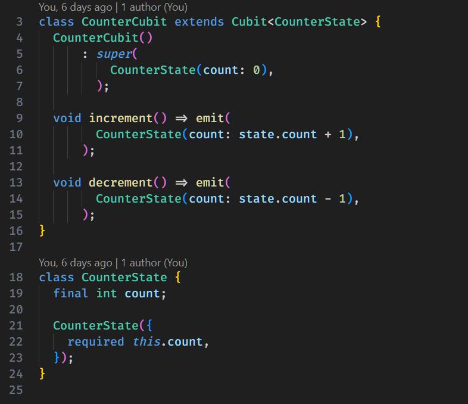
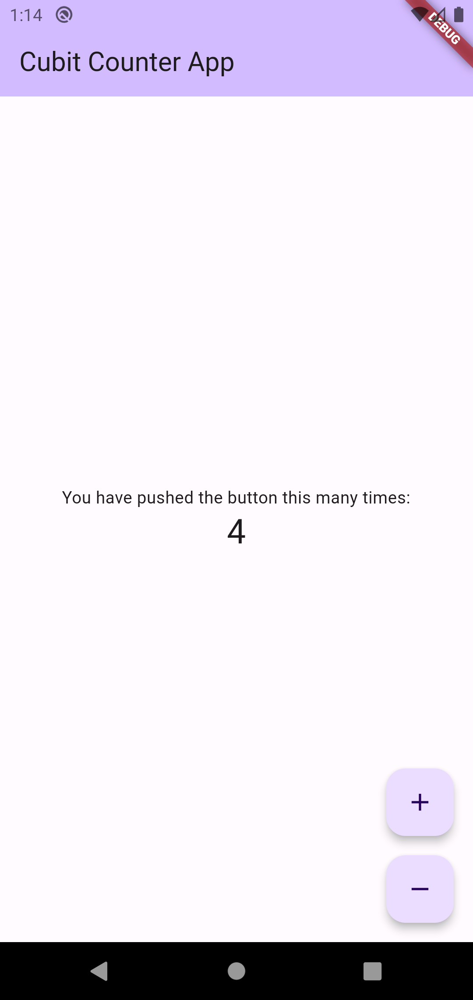

# Flutter Cubit Tutorial App

This Flutter application is a tutorial for implementing Cubit architecture in your Flutter projects. The tutorial is part of a larger programming tutorial series, which will be uploaded to the [Faradars website](https://faradars.org).

## Table of Contents

- [Images](#Images)
- [Introduction](#introduction)
- [Features](#features)
- [Installation](#installation)
- [Usage](#usage)
- [Dependencies](#dependencies)
- [Contributing](#contributing)
- [License](#license)

## Images 

Cubit Code 
 


Project UI



## Introduction

This Flutter application serves as a practical guide to understanding and implementing the Cubit state management architecture. The tutorial covers essential concepts and best practices for using Cubit in Flutter development.

## Features

- Demonstrates basic Cubit setup and usage
- Illustrates how to handle state changes using Cubit
- Provides examples of asynchronous operations with Cubit
- Includes a sample application showcasing the principles learned in the tutorial

## Installation

To run this Flutter application locally, follow these steps:

1. Clone the repository:

   ```bash
   git clone https://github.com/your-username/your-repository.git
   ```

2. Navigate to the project directory:

   ```bash
   cd your-repository
   ```

3. Install dependencies:

   ```bash
   flutter pub get
   ```

## Usage

After completing the installation, you can run the application on an emulator or a physical device using the following command:

```bash
flutter run
```

The application will launch, and you can explore the Cubit tutorial and the sample application.

## Dependencies

This project uses the following dependencies:

- [flutter_bloc](https://pub.dev/packages/flutter_bloc): State management library for Flutter applications.

Make sure to check the `pubspec.yaml` file for the most up-to-date list of dependencies.

## Contributing

If you'd like to contribute to this project, please follow these guidelines:

1. Fork the repository
2. Create a new branch
3. Make your changes
4. Submit a pull request

## License

This Flutter application is open-source and available under the [MIT License](LICENSE).

Feel free to use this code as a reference or starting point for your own Flutter projects.

Happy coding!
